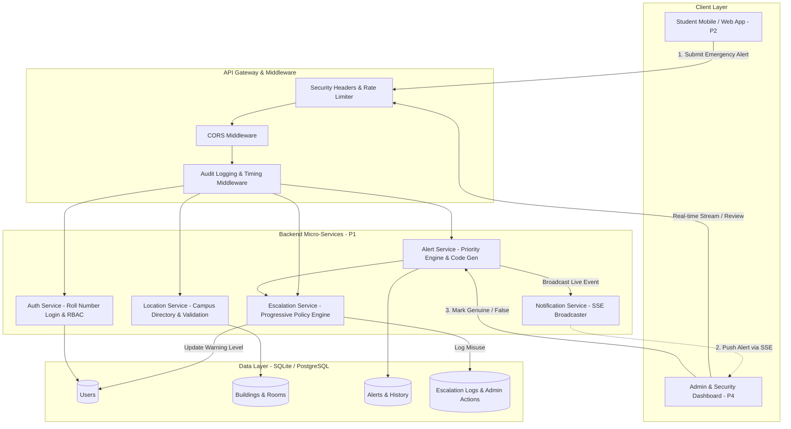

# Campus Emergency Assistance System — System Architecture

## 1. Executive Summary
The Campus Emergency Assistance System is a specialized, real-time safety network designed to replace manual, delay-prone campus emergency communication with instantaneous room-level digital alerting and structured administrative triage.

---

## 2. Core Functional Pillars

### 2.1 Structured Indoor Location Hierarchy
Continuous GPS is unreliable indoors and across multi-floor academic buildings. The system captures structured locations:
$$\text{Location} = (\text{Building Code}, \text{Floor Number}, \text{Room Identifier}, \text{Wing})$$
Responders navigate directly to the physical room in seconds without ambiguity.

### 2.2 Dynamic Emergency Prioritization Engine
Alerts are prioritized immediately upon ingestion:
| Hazard Category | Priority Tier | Dispatched Protocol |
|---|---|---|
| Fire / Smoke | `CRITICAL` | Campus sirens, Security alert, Fire dept liaison |
| Medical Emergency | `CRITICAL` | First aid team dispatch, Ambulance liaison |
| Harassment / Threat | `CRITICAL` | Immediate perimeter guard dispatch |
| Accident | `HIGH` | Floor warden notification, Medical kit |
| Fainting / Unconsciousness | `HIGH` | Stretcher & medical attendant dispatch |
| Fall / Injury | `MEDIUM` | First-responder check |
| Other Emergency | `MEDIUM` | Security desk review |

### 2.3 Progressive Human-in-the-Loop Escalation
To protect system integrity from prank alerts while avoiding wrongful punitive actions:
1. **1st False Alert**: Formal system warning issued (`warning`), incident logged in audit trail.
2. **2nd False Alert**: Official strong warning issued (`strong_warning`), mentor notified.
3. **3rd / Repeated False Alert**: Persistent misuse referred to Higher Administration (`referred_to_higher_authority` — Dean & Disciplinary Committee) for formal inquiry.

---

## 3. Non-Functional Specifications
- **Latency**: End-to-end alert submission to admin queue latency $< 50\text{ms}$.
- **Resilience**: 45-second debounce window prevents accidental double-tap spamming.
- **Security**: Sliding-window rate limiters prevent denial-of-service and credential stuffing.
- **Auditability**: Every administrative decision is recorded with admin ID, timestamp, and justification.
