# Database Schema & Data Dictionary

Database Engine: **SQLite (Production: PostgreSQL compatible)**  
ORM: **SQLAlchemy 2.0+**

```mermaid
erDiagram
    USERS ||--o{ ALERTS : triggers
    USERS ||--o{ ESCALATION_LOGS : incurs
    USERS ||--o{ ADMIN_ACTIONS : performs
    BUILDINGS ||--o{ ROOMS : contains
    BUILDINGS ||--o{ ALERTS : locates
    ALERTS ||--o{ ALERT_STATUS_HISTORY : tracks
    ALERTS ||--o{ ESCALATION_LOGS : references
    ALERTS ||--o{ ADMIN_ACTIONS : reviews

    USERS {
        int id PK
        string roll_number UK
        string full_name
        string email UK
        string phone
        string role "student | admin | hod"
        string department
        int offense_count
        string warning_status
        boolean is_active
        datetime created_at
    }

    BUILDINGS {
        int id PK
        string code UK
        string name
        string description
        int total_floors
        datetime created_at
    }

    ROOMS {
        int id PK
        int building_id FK
        string room_number
        int floor
        string wing
        string room_type
        datetime created_at
    }

    ALERTS {
        int id PK
        string alert_code UK
        int student_id FK
        string emergency_type
        string priority "CRITICAL | HIGH | MEDIUM | LOW"
        string status "NEW | ACKNOWLEDGED | RESOLVED_GENUINE | RESOLVED_FALSE | ESCALATED"
        int building_id FK
        string room_number
        int floor
        float latitude
        float longitude
        text description
        datetime created_at
        datetime updated_at
    }

    ALERT_STATUS_HISTORY {
        int id PK
        int alert_id FK
        string previous_status
        string new_status
        int changed_by_user_id FK
        text remarks
        datetime timestamp
    }

    ESCALATION_LOGS {
        int id PK
        int student_id FK
        int alert_id FK
        int offense_number
        string warning_level
        string action_taken
        text remarks
        datetime timestamp
    }

    ADMIN_ACTIONS {
        int id PK
        int admin_id FK
        int alert_id FK
        string action_type
        text comments
        datetime timestamp
    }
```

---

## Table Dictionary

### 1. `users`
| Column | Type | Constraints | Description |
|---|---|---|---|
| `id` | INTEGER | PRIMARY KEY | Unique user record ID |
| `roll_number` | VARCHAR(50) | UNIQUE, NOT NULL | Student Roll No (e.g. `21CS001`) or Staff ID (`ADMIN01`) |
| `full_name` | VARCHAR(100) | NOT NULL | Full name of the user |
| `email` | VARCHAR(120) | UNIQUE | Campus institutional email |
| `phone` | VARCHAR(20) | NULLABLE | Primary emergency mobile contact |
| `role` | VARCHAR(20) | NOT NULL | Role: `student`, `admin`, `hod` |
| `department` | VARCHAR(100) | NULLABLE | Department affiliation |
| `offense_count`| INTEGER | DEFAULT 0 | Count of validated false alarms submitted |
| `warning_status`| VARCHAR(50)| DEFAULT 'none'| Warning tier (`none`, `warning`, `strong_warning`, `referred_to_higher_authority`) |
| `is_active` | BOOLEAN | DEFAULT TRUE | Account operational status |
| `created_at` | DATETIME | NOT NULL | Timestamp of account registration |

### 2. `buildings`
| Column | Type | Constraints | Description |
|---|---|---|---|
| `id` | INTEGER | PRIMARY KEY | Unique building record ID |
| `code` | VARCHAR(20) | UNIQUE, NOT NULL | Building code (`ENG-A`, `SCI-MAIN`, `LIB`) |
| `name` | VARCHAR(100) | NOT NULL | Full building title |
| `description` | VARCHAR(255) | NULLABLE | Details of departments/facilities housed |
| `total_floors`| INTEGER | DEFAULT 4 | Total floors including ground floor |

### 3. `rooms`
| Column | Type | Constraints | Description |
|---|---|---|---|
| `id` | INTEGER | PRIMARY KEY | Unique room record ID |
| `building_id` | INTEGER | FK -> buildings.id | Parent building reference |
| `room_number` | VARCHAR(20) | NOT NULL | Room identifier (e.g. `101`, `LAB-1`) |
| `floor` | INTEGER | NOT NULL | Floor index (0=Ground, 1, 2, 3...) |
| `wing` | VARCHAR(20) | DEFAULT 'Main' | Architectural wing (`East`, `West`, `North`, `South`) |
| `room_type` | VARCHAR(50) | DEFAULT 'Classroom'| Purpose (`Lab`, `Seminar Hall`, `Faculty Room`, etc.) |

### 4. `alerts`
| Column | Type | Constraints | Description |
|---|---|---|---|
| `id` | INTEGER | PRIMARY KEY | Unique alert ID |
| `alert_code` | VARCHAR(50) | UNIQUE, NOT NULL | Human-readable tracking code (e.g. `ALT-20261001-4921`) |
| `student_id` | INTEGER | FK -> users.id | Submitting student reference |
| `emergency_type`| VARCHAR(50)| NOT NULL | Hazard classification |
| `priority` | VARCHAR(20) | NOT NULL | Triage tier (`CRITICAL`, `HIGH`, `MEDIUM`) |
| `status` | VARCHAR(20) | NOT NULL | Lifecycle status (`NEW`, `ACKNOWLEDGED`, `RESOLVED_GENUINE`, `RESOLVED_FALSE`) |
| `building_id` | INTEGER | FK -> buildings.id | Building of emergency |
| `room_number` | VARCHAR(20) | NOT NULL | Room of emergency |
| `floor` | INTEGER | NOT NULL | Floor number |
| `description` | TEXT | NULLABLE | Optional text description |
| `created_at` | DATETIME | NOT NULL | Precise timestamp of distress signal |

### 5. `alert_status_history`
Tracks every state change from `NEW` to `ACKNOWLEDGED` to resolution.

### 6. `escalation_logs`
Immutable audit log recording every offense increment, warning issued, or higher authority referral.

### 7. `admin_actions`
Accountability record tracking every administrative click and triage response with comments.
